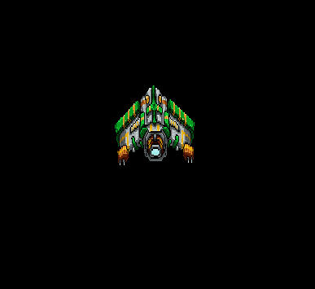
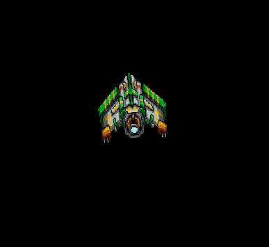

# rotate example with mouse

## animated movement to tap

## move to tap

with deceleration

## immediately shift angle

I'm looking for an easier way to rotate the ship.  Send me
a better method if you an idea.
